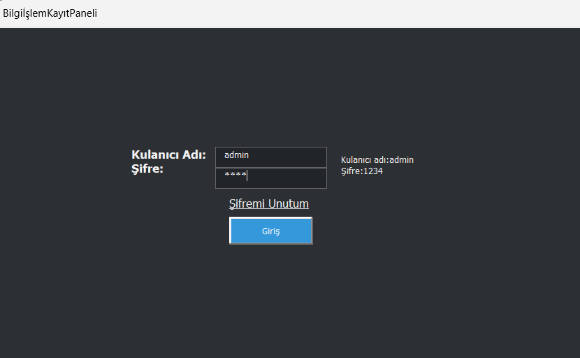
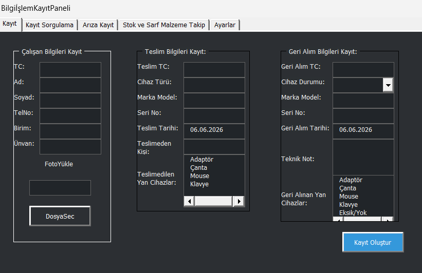
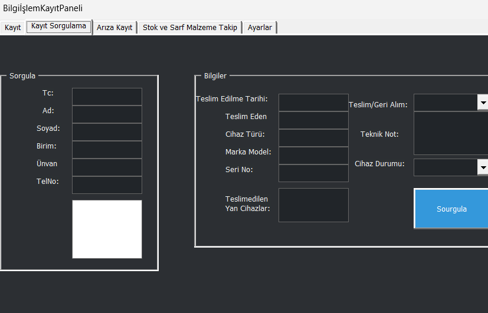
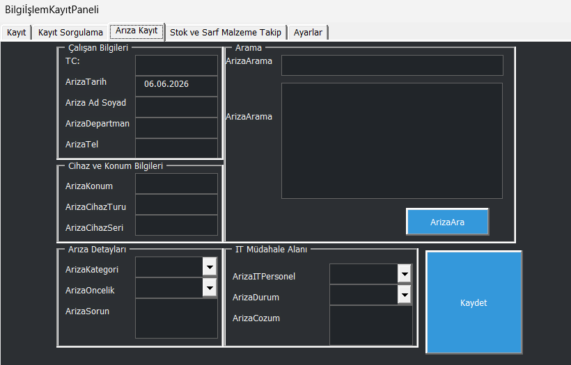
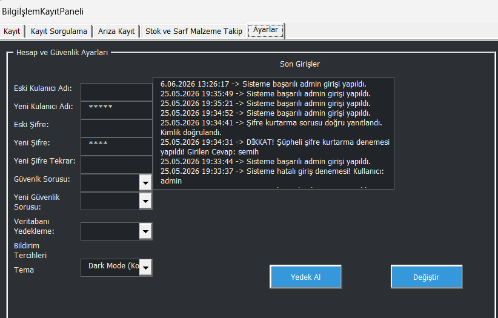

# Helpdesk Otomasyonu

Excel VBA ile geliştirilmiş helpdesk, zimmet, arıza ve stok takip otomasyonudur. Proje; personel kayıtları, cihaz teslim/iade süreçleri, arıza kayıtları, stok-depo takibi, sistem ayarları, tema yönetimi, loglama ve yedekleme işlemlerini tek bir `.xlsm` dosyası üzerinden yönetmek için hazırlanmıştır.

## İçindekiler

- [Özellikler](#özellikler)
- [Ekran Görüntüleri](#ekran-görüntüleri)
- [Gereksinimler](#gereksinimler)
- [Kurulum](#kurulum)
- [Kullanım](#kullanım)
- [Excel Sayfa Yapısı](#excel-sayfa-yapısı)
- [Varsayılan Giriş Bilgileri](#varsayılan-giriş-bilgileri)
- [Yedekleme ve Loglama](#yedekleme-ve-loglama)
- [Proje Dosyaları](#proje-dosyaları)

## Özellikler

- **Giriş sistemi:** Kullanıcı adı ve şifre ile oturum açma.
- **Şifre kurtarma:** Güvenlik cevabı ile kullanıcı adı ve şifre bilgilerini görüntüleme.
- **Personel / zimmet yönetimi:** Çalışan bilgisi, teslim edilen cihaz ve iade kayıtlarını tutma.
- **Kayıt sorgulama:** TC/ID üzerinden çalışan, teslimat ve iade bilgilerini sorgulama.
- **Arıza takip modülü:** Cihaz arızalarını kaydetme ve arıza numarası ile arama.
- **Stok ve depo yönetimi:** Ürün adı, kategori, miktar ve kritik stok takibi.
- **Kritik stok uyarısı:** Minimum stok seviyesinin altına düşen ürünleri bildirme.
- **Ayarlar paneli:** Kullanıcı adı, şifre, güvenlik cevabı, tema ve font ayarlarını kaydetme.
- **Tema desteği:** Açık tema ve koyu tema seçenekleri.
- **Kalıcı log sistemi:** Giriş, kayıt, arıza, stok ve yedekleme işlemlerini kayıt altına alma.
- **Yedekleme:** Çalışma kitabının tarih/saat bilgili `.xlsm` yedeğini oluşturma.

## Ekran Görüntüleri

| Ekran | Görsel |
| --- | --- |
| Giriş Ekranı |  |
| Kayıt Ekranı |  |
| Kayıt Sorgulama |  |
| Arıza Kayıt |  |
| Stok ve Sarf Malzeme Takip |  |
| Ayarlar ve Log |  |

## Gereksinimler

- Microsoft Excel
- Makro çalıştırma izni
- Windows ortamı önerilir
- VBA destekli Excel sürümü

> Not: Dosya `.xlsm` formatında olduğu için Excel açıldığında makroların etkinleştirilmesi gerekir.

## Kurulum

1. Bu projeyi bilgisayarınıza indirin veya klonlayın.
2. `2405242054SemihŞeker.xlsm` dosyasını Microsoft Excel ile açın.
3. Excel güvenlik uyarısı gösterirse **İçeriği Etkinleştir** / **Makroları Etkinleştir** seçeneğini kullanın.
4. Giriş ekranından sisteme giriş yapın.

## Kullanım

### 1. Giriş

Uygulama açıldığında giriş ekranı görüntülenir. Kullanıcı adı ve şifre doğruysa ana otomasyon paneli açılır.

### 2. Personel ve Zimmet Kaydı

Kayıt ekranından çalışan bilgileri girilir. Cihaz teslim ve iade bilgileri ilgili Excel sayfalarına kaydedilir.

### 3. Kayıt Sorgulama

Sorgulama ekranında çalışan ID/TC bilgisi girilerek personel, teslimat ve iade kayıtları görüntülenebilir.

### 4. Arıza Kaydı

Arıza modülünde çalışan ve cihaz bilgileriyle arıza kaydı oluşturulur. Kayıtlar arıza numarası üzerinden tekrar aranabilir.

### 5. Stok ve Depo Takibi

Stok ekranından ürün bilgisi, kategori, miktar ve minimum stok seviyesi kaydedilir. Kritik stok seviyesine düşen ürünler için uyarı verilir.

### 6. Ayarlar

Ayarlar ekranından kullanıcı adı, şifre, güvenlik cevabı, tema ve font ayarları güncellenebilir.

## Excel Sayfa Yapısı

Uygulama aşağıdaki çalışma sayfalarını kullanır:

- `Ayarlar`: Kullanıcı bilgileri, tema/font ayarları ve sistem logları.
- `Calisanlar`: Personel kayıtları.
- `Teslimat`: Cihaz teslim kayıtları.
- `Geri_Alim`: Cihaz iade kayıtları.
- `Arizalar`: Arıza kayıtları.
- `Stok_Depo`: Stok ve depo kayıtları.

Bu sayfa adlarının değiştirilmemesi gerekir. VBA kodu bu adlar üzerinden çalışır.

## Varsayılan Giriş Bilgileri

İlk kullanımda ayarlar sayfasında kullanıcı bilgisi yoksa sistem varsayılan olarak aşağıdaki bilgileri kullanır:

```text
Kullanıcı adı: admin
Şifre: 1234
```

Güvenlik için ilk girişten sonra ayarlar ekranından bu bilgileri değiştirmeniz önerilir.

## Yedekleme ve Loglama

- Yedekleme işlemi `Yedekler` klasörü altında tarih/saat bilgisi içeren `.xlsm` dosyası oluşturur.
- Örnek yedek adı: `IT_Sistem_Yedek_06_06_2026_13_30_00.xlsm`
- Log kayıtları `Ayarlar` sayfasında tutulur.
- Başarılı/hatalı girişler, kayıt işlemleri, stok işlemleri ve yedekleme işlemleri loglanır.

## Proje Dosyaları

```text
helpdeskotamasyonu/
├── 2405242054SemihŞeker.xlsm
├── code.vba
├── girişekranı.png
├── kayıtekranı.png
├── kayıtsorgulama.png
├── arızakayıt.png
├── stok ve sarf malzeme takip.png
├── ayarlarvelog.png
└── README.md
```

## Geliştirici Notları

- VBA kodlarının metin hali `code.vba` dosyasında bulunur.
- Excel dosyasında makrolar etkin değilse uygulama çalışmaz.
- Sayfa adları VBA kodunda sabit kullanıldığı için sayfa isimleri korunmalıdır.
- Kullanıcı arayüzü `UserForm` ve `MultiPage` yapısı üzerine kuruludur.
